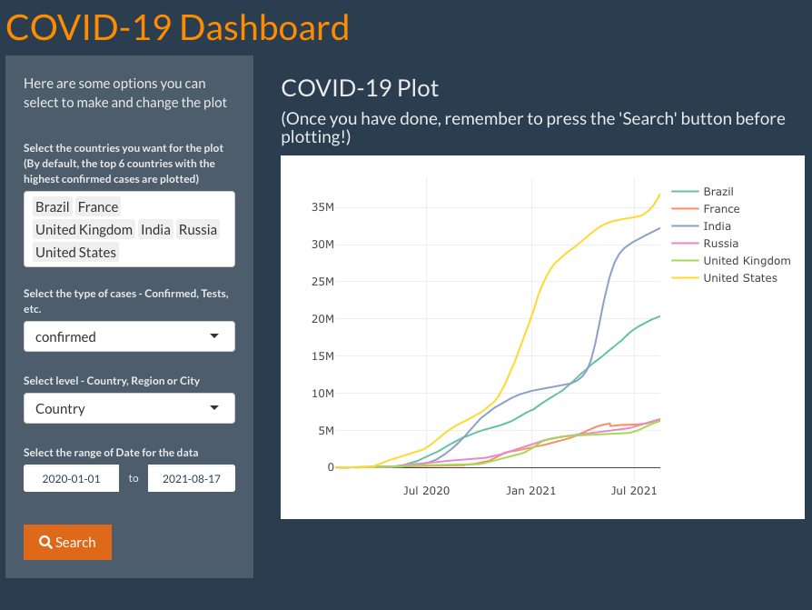

```{r setup, include=FALSE}
knitr::opts_chunk$set(echo = FALSE,warning = FALSE,message = FALSE)
```

## Overview



## Introduction

This is a simple COVID-19 dashboard

Access the shiny app [here](https://z3v3c4-zhiyi-sun.shinyapps.io/covid19rshiny/)

See the github repo that hosts the files [here](https://github.com/zsun255/COVID-19-Dashboard.git)

## COVID-19 Data Hub 

The data was provided with a package by the COVID-19 Data Hub, which you can access [here](https://covid19datahub.io/articles/api/r.html)

Look at the Documentation [here](https://covid19datahub.io/articles/doc/data.html) 

Download the data [here](https://covid19datahub.io/articles/data.html)

## UI

The COVID19 R package provides an imtegration with COVID-19 Data Hub via the covid19() function.

In our UI, we define the following inputs:

 `country` - country name   
 `type` - metric (confirmed, tests, recovered, etc.)   
 `level` - country, region or city   
 `dates` - start and end dates  
 
## ui.R

```{r, echo = TRUE, eval = FALSE}
library(shiny)
library(shinythemes)
library(shinydashboard)
library(plotly)
library(COVID19)

ui <- fluidPage(
  theme = shinytheme("superhero"),
  h1(id="title", "COVID-19 Dashboard"),
  tags$style(HTML("#title{color: darkorange;}")),
  sidebarLayout(
    sidebarPanel(
      
      p("Here are some options you can select to make and change the plot"),
      br(),
      
      selectInput(
        "country",
        label = "Select the countries you want for the plot (By default, the top 6 countries with the highest confirmed cases 
              are plotted)",
        multiple = TRUE,
        choices = unique(covid19()$administrative_area_level_1),
        selected = c("United States", 
                     "India", 
                     "Brazil", 
                     "Russia",
                     "United Kingdom",
                     "France")
      ),
      
      selectInput(
        "type",
        label = "Select the type of cases - Confirmed, Tests, etc.",
        choices = c(
          "confirmed",
          "tests",
          "recovered",
          "deaths",
          "vaccines"
        )
      ),
      
      selectInput(
        "level",
        label = "Select level - Country, Region or City",
        choices = c(
          "Country" = 1,
          "Region" = 2,
          "City" = 3
        ),
        selected = 1
      ),
      
      dateRangeInput(
        "date",
        label = "Select the range of Date for the data",
        start = "2020-01-01"
      ),
      
      br(),
      submitButton("Search",icon = icon("search"))
    ),
    
    mainPanel(
      h3("COVID-19 Plot"), 
      h4("(Once you have done, remember to press the \'Search\' button before plotting!)"),
      plotlyOutput("covid19plot")
    )
  )
)
```

## Server 

In server.R, we connect inputs (from the UI) to the `covid19()` function to fetch the data. Then, we use plotly to render the plot, and output it from the UI. 

## server.R

```{r, echo = TRUE, eval = FALSE}
server <- function(input, output) {
  output$covid19plot <- renderPlotly({
    if (!is.null(input$country)) {
      x <- covid19(
        country = input$country,
        level = input$level,
        start = input$date[1],
        end = input$date[2]
      )
      color <- paste0("administrative_area_level_", input$level)
      plot_ly(x = x[["date"]],
              y = x[[input$type]],
              color = x[[color]],
              type = 'scatter',
              mode = 'lines')
    }
  })
}
```

## Credit

> Guidotti et al., (2020). COVID-19 Data Hub. Journal of Open Source Software, 5(51), 2376, https://doi.org/10.21105/joss.02376